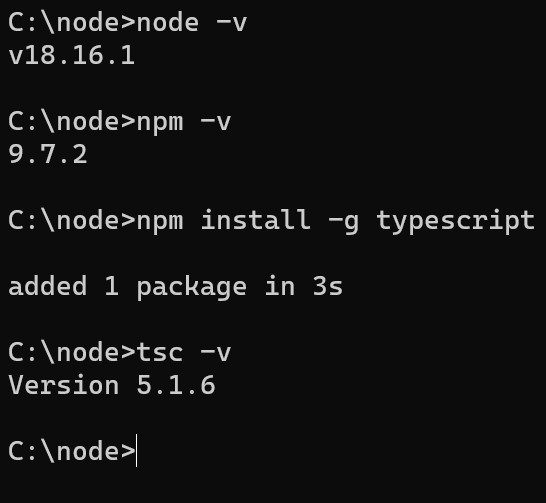

# TypeScript Guide 

| TypeScript is a programming language that is a superset of JavaScript. It adds static typing and other features to JavaScript, providing additional tools for building large-scale, maintainable applications. It is designed and maintained by Microsoft. | <pre>
C:\node>node -v
v18.16.1
C:\node>npm -v
9.7.2
C:\node>npm install -g typescript
added 1 package in 3s
C:\node>tsc -v
Version 5.1.6
C:\node>  
</pre>

|  |  |
|-------|-------------|

